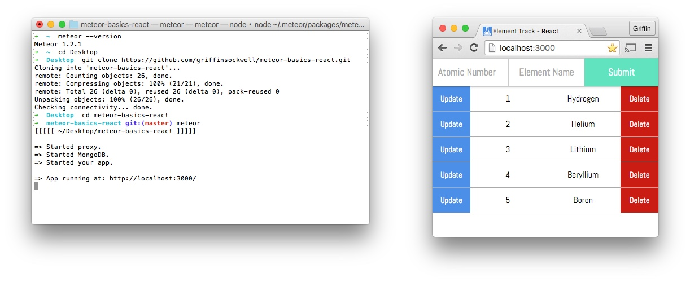

# Element Track

Track your favorite elements from the [periodic table](https://en.wikipedia.org/wiki/Periodic_table). Input elements by their Atomic Number and Element Name.

A simple app to understand the basics of Meteor and React. To run this app make sure you have Meteor [installed](https://www.meteor.com/install).

